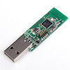

# 1. Hardware requirements
In order to run the zigbee2mqtt bridge we need the following hardware:

| Name | Price | Picture |
| ------------- | ------------- | ------------- |
| CC debugger | +-10$ on AliExpress |  |
| CC2531 USB sniffer | +-10$ on AliExpress |  |
| Downloader cable CC2531 | +-3.50$ on AliExpress |  |
| [Supported Zigbee device(s)](https://github.com/Koenkk/zigbee2mqtt/wiki/Supported-devices) | - |  |
| PC or Raspberry Pi to run bridge | - |  |

# 2. Flashing the CC2531 USB stick
The CC2531 USB stick needs to be flashed with a custom firmware. The following instructions assume you have a CC Debugger. In case you don't, see [Alternative firmware flashing methods](https://github.com/Koenkk/zigbee2mqtt/wiki/Alternative-firmware-flashing-methods).

## For Windows

1. Install [SmartRF Flash programmer](http://www.ti.com/tool/FLASH-PROGRAMMER) (**NOT V2**). This software is free but requires a Texas Instruments account in order to download.
2. Install the [CC debugger driver](http://www.ti.com/general/docs/lit/getliterature.tsp?baseLiteratureNumber=swrc212&fileType=zip) on your PC (Windows only). Before continuing, verify that the CC Debugger driver has been installed correctly. See [Figure 1. Verify Correct Driver Installation @ Chapter 5.1](http://www.ti.com/lit/ug/swru197h/swru197h.pdf). In case the CC Debugger is not recognized correctly [install the driver manually](https://www.youtube.com/watch?v=jyKrxxXOvQY).
2. Connect `CC debugger --> Downloader cable CC2531 --> CC2531 USB sniffer`.
3. Connect **BOTH** the `CC2531 USB sniffer` and the `CC debugger` to your PC using USB.
3. If the light on the CC debugger is RED press set reset button on the CC debugger. The light on the CC debugger should now turn GREEN. If not use [CC debugger user guide](http://www.ti.com/lit/ug/swru197h/swru197h.pdf) to troubleshoot your problem.

4. Download the firmware [CC2531ZNP-Prod.hex](https://raw.githubusercontent.com/Koenkk/Z-Stack-firmware/master/coordinator/CC2531/bin/CC2531ZNP-Prod.hex)
5. Start SmartRF Flash Programmer, setup as shown below and press `Perform actions`.


## For Linux/MacOS
Credits to [@Frans-Willem](https://github.com/frans-Willem) for majority of instructions. 

1. Install prerequisites for [CC-Tool](https://github.com/dashesy/cc-tool) using a package manager (e.g. [Homebrew](https://brew.sh/) for macOS)
> Ubuntu: dh-autoreconf, libusb-1.0, libboost-all-dev  
> Fedora: dh-autoreconf, boost-devel, libusb1-devel  
> Archlinux: dh-autoreconf, libusb, boost  
> macOS: autoconf, automake, libusb, boost, pkgconfig, libtool  

2. Build your cc-tool
```
git clone https://github.com/dashesy/cc-tool.git
cd cc-tool
./bootstrap
./configure
make
```
3. Connect `CC debugger --> Downloader cable CC2531 --> CC2531 USB sniffer`.
4. Connect **BOTH** the `CC2531 USB sniffer` and the `CC debugger` to your PC using USB.
5. If the light on the CC debugger is RED, press the Reset button on the CC debugger. The light on the CC debugger should now turn GREEN. If not, follow the [CC debugger user guide](http://www.ti.com/lit/ug/swru197h/swru197h.pdf) to troubleshoot your problem.

6. Download the firmware [CC2531ZNP-Prod.hex](https://raw.githubusercontent.com/Koenkk/Z-Stack-firmware/master/coordinator/CC2531/bin/CC2531ZNP-Prod.hex).
7. Flash your firmware:
```
sudo ./cc-tool -e -w CC2531ZNP-Prod.hex
```

# 3. Done!
Continue with [Running the bridge](https://github.com/Koenkk/zigbee2mqtt/wiki/Running-the-bridge).